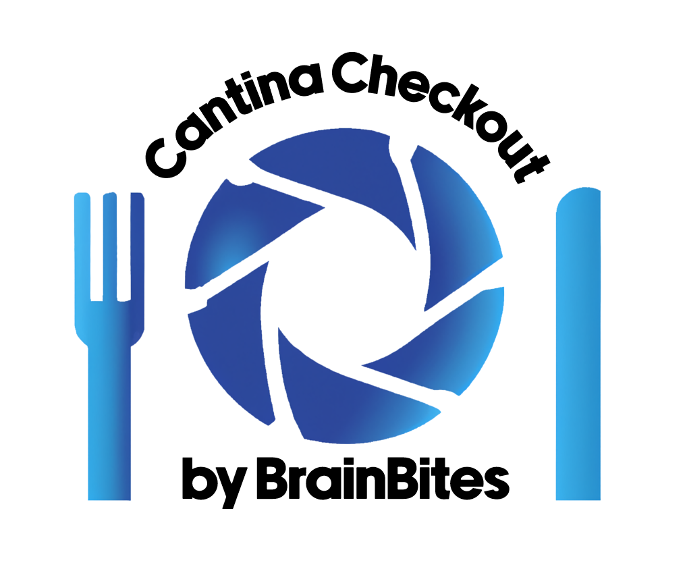
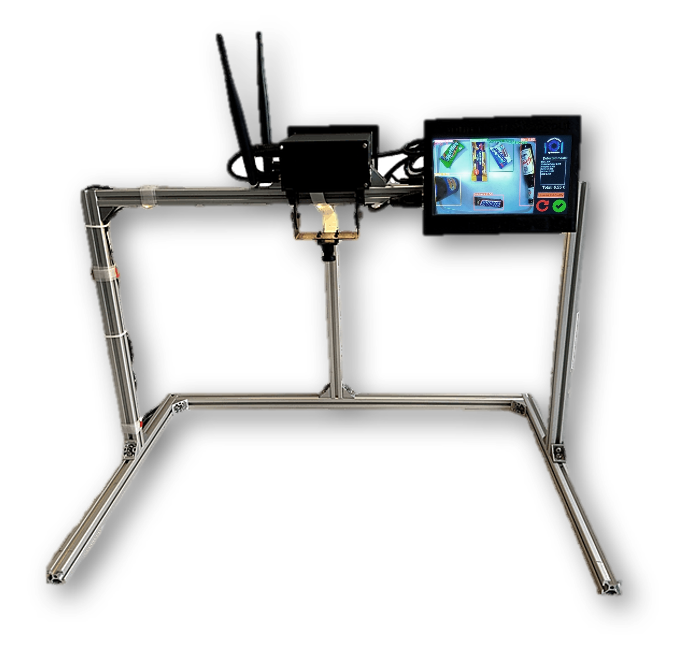
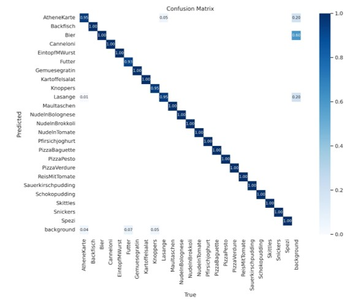
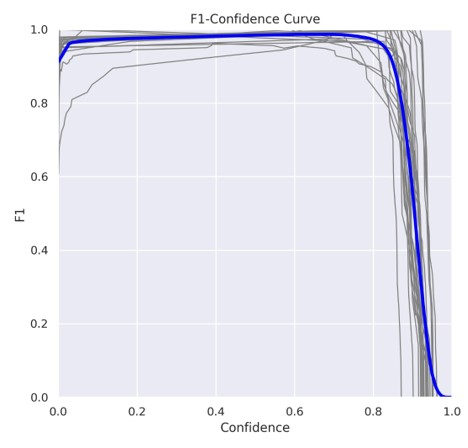

# Cantina Self Checkout

At peak times, the mensa at our university is very crowded. We want to solve this Problem.

The goal of the project is to create a self-checkout system for a canteen.\
You have to slide your food tray with the meals under a camera. The system detects the food
using a neural network and automatically calculates the cost of everything on the tray.

The program is started with gui.py. On the Jetson you can click the logo on the desktop center to start the program.

# Hardware Setup

- Jetson Nano
- CSI Camera with mounting
- robust prototype out of aluminum profiles

# Objects to detect

- Drinks
- Snacks
- Main dishes
- Side dishes 
- Desserts

A full list of all objects can be found in the file ['classes.txt'](classes.txt).

# Advantages

### Advantages for the Students

- faster, because all cashier checkouts can be open all the time
- cost savings through lower staff costs, which can even be forwarded to students

### Advantages for the canteen

- cost savings
- relocation of staff capacities
- scalability

# Data Science Aspects

### Data Acquisition:
- collection of over 2000 images of different food
- different sources (smartphone camera, calibrated CSI camera, non-calibrated CSI camera)

### Target Variables
- Classes of different food
- Bounding boxes of food

### Input Features
- Images of food on food tray (from a top view)

### Models:
- YOLOv5
- YOLOv8

### Data Preparation:
We used Roboflow for dataset management.\
The following steps were performed:
- data normalization (rescale to 640x640)
- Data labeling (bounding boxes)
- Data augmentation (to get better accuracy)
- Data cleaning
- 

### Evaluation:
- mAP (mean average precision)
- F1 score over confidence
- Confusion matrix

### Success Criteria:

### Constraints:

### Business Value:
